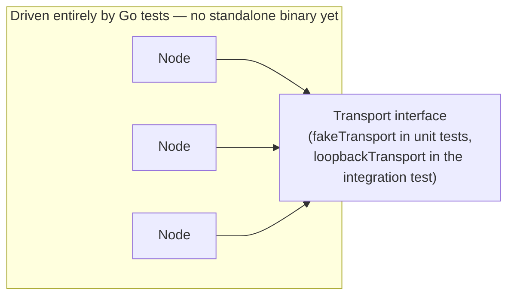
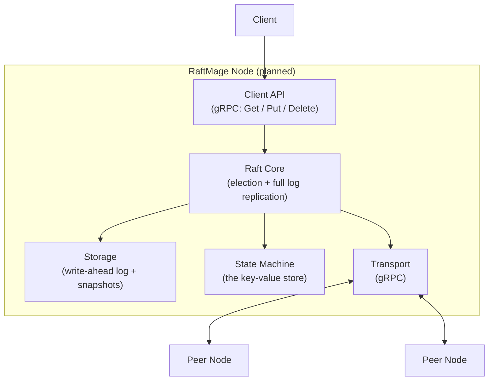

<div align="center">

# RaftMage

**A distributed key-value store built from scratch in Go, implementing the Raft consensus algorithm.**

[](go.mod)
[](https://github.com/KayBee1880/RaftMage/actions/workflows/ci.yml)
[](LICENSE)
[](docs/architecture.md)

*Every claim in this README is either true right now — verifiable with the commands below — or explicitly marked planned.*

</div>

## What this is

RaftMage is a small, from-scratch distributed key-value store. For infrastructure like this, the `Get`/`Put`/`Delete` API isn't really the product — the guarantee behind it is: that a write the cluster acknowledges survives node crashes, leader failures, and network partitions without being lost or silently contradicted. Raft, the consensus algorithm this project implements from first principles, is what makes that guarantee real instead of aspirational. Everything here is built and tested to prove the guarantee holds, not just to look like it does.

## Why this project exists

A single-node key-value store is easy. Making it survive a crash without losing data, or without serving stale or contradictory answers during a leader failure or network partition, is the actual problem distributed databases exist to solve — and it's provably impossible to solve perfectly, only to engineer a deliberate, defensible tradeoff for. RaftMage exists to build and prove one specific, well-understood answer to that problem at a small enough scale that every line of the consensus logic can be read, tested, and explained.

See [docs/architecture.md](docs/architecture.md) for the full design rationale, including why Raft was chosen and how the pieces fit together.

## Engineering approach

Principles this build has actually practiced — each one checkable against the commit history or the code itself, not aspirational:

- **No invented numbers.** Every count in this README (tests, components) comes straight from running `go test`/reading the code, not an estimate.
- **Reasoning is documented as "naive approach → why it breaks → the fix,"** not just "here's the code." Design docs and code-level rationale consistently explain why a simpler approach — a fixed (non-randomized) election timeout, or counting replicas without Raft's current-term-only commit rule — would be unsafe or livelock the cluster, before describing what's actually implemented.
- **Safety is enforced at the core, not left to callers.** All node-state mutation goes through a single mutex-guarded path inside the `Node` type; a `*Locked` naming convention makes it explicit which internal functions assume the lock is already held, so correctness doesn't depend on every caller remembering to lock correctly.
- **Deferred and rejected scope is stated explicitly, not silently absent.** [docs/architecture.md](docs/architecture.md) tracks Implemented vs. Planned per component; the Roadmap below does the same.
- **Tests exercise real logic, not mocks pretending to be the system.** The network is the only thing faked (`fakeTransport` for unit tests, an in-process `loopbackTransport` for the multi-node integration test) — the actual consensus logic, including real goroutines, timers, and vote counting, runs for real.
- **CI runs the full suite with Go's race detector** (`go test ./... -race`) on every push and pull request — concurrency bugs are a CI gate, not something caught by hoping.

## What's actually working right now

- **Leader election** (`RequestVote` RPC) implementing Raft's full safety rules: one vote per term, and a candidate's log must be at least as up to date as the voter's before it gets a vote.
- **Automatic elections** — a randomized election-timeout loop (150–300ms per node) that triggers a new election with no manual intervention, specifically to avoid every node timing out simultaneously and splitting the vote forever.
- **Leader liveness** — `AppendEntries` heartbeats every 50ms that keep a healthy elected leader in power. Proven with three real `Node` instances in a genuine election, not just asserted: `TestLeaderHeartbeatsPreventFollowerReelection`.
- **Log replication (follower side)** — consistency checking against `PrevLogIndex`/`PrevLogTerm`, truncation of conflicting entries, idempotent handling of retried/duplicate RPCs, and commit-index advancement bounded by what's actually stored locally.
- **Log replication (leader side)** — per-follower `nextIndex`/`matchIndex` tracking, immediate retry at an earlier log position on rejection, and commit-index advancement gated by Raft's current-term-only rule (a leader can only directly commit an entry from its own term, never an earlier one, no matter how widely replicated). Proven with three real `Node` instances, not just asserted: `TestLeaderReplicatesAndCommitsAcrossRealNodes`.
- **Client-facing write API (`Propose`)** — the first way to actually get a write into the cluster: rejected outright on a non-leader (`isLeader == false`, so a client knows to look elsewhere), otherwise appended to the leader's log and replicated immediately rather than waiting for the next 50ms heartbeat tick. A single-node cluster commits its own proposal instantly, since the leader alone is already a majority.
- **40 tests, all passing**, run automatically on every push and pull request via GitHub Actions (`go build`, `go vet`, `go test -race`).

Everything above runs today only inside Go's test runner — there is no standalone server binary or client yet. See Roadmap.

## Architecture

**Current state** — what's really running today. No client, no real network, no standalone process: `Node` instances talk to each other only through an in-process `Transport` implementation, orchestrated entirely by Go's test runner.



**Target state** — the eventual system this is building toward. Not yet built; shown for direction, not to claim it exists.



## Tech stack

**In use today**

| Component | Why |
|---|---|
| Go 1.26 | Goroutines/channels map directly onto Raft's concurrent RPC fan-out and per-role background timers; strong static typing catches a class of consensus bugs at compile time. |
| Go's standard `testing` package | Sufficient for the current unit + integration test needs; no external framework justified yet. |
| GitHub Actions | Free, native CI for a GitHub-hosted repo; runs build, `vet`, and race-detector tests on every push/PR. |

**Planned**

| Component | Milestone |
|---|---|
| gRPC + Protocol Buffers | Real network transport |
| Custom write-ahead log | Persistence & crash recovery |
| Log compaction | Snapshotting |
| Deterministic simulation harness (fault injection) | Correctness testing under partitions/crashes |
| Structured logs + metrics | Observability |

## Roadmap

- [x] Raft node core state (roles, terms, log)
- [x] Leader election (`RequestVote` RPC, full safety rules)
- [x] Randomized election-timeout loop (automatic elections)
- [x] `AppendEntries` heartbeats (leader liveness)
- [x] Log replication — follower side (consistency check, append/truncate, commit index)
- [x] Log replication — leader side (`nextIndex`/`matchIndex`, retry, commit advancement)
- [x] Client-facing write API (`Propose`)
- [ ] **Persistent write-ahead log + crash recovery** ← current
- [ ] Snapshotting + log compaction
- [ ] Real gRPC transport
- [ ] Cluster membership changes
- [ ] Deterministic simulation / fault-injection testing
- [ ] Observability (structured logs, metrics)
- [ ] Sharding (stretch goal, past the core single-group KV store)

Fuller status, including what's implemented vs. planned per component: [docs/architecture.md](docs/architecture.md).

## Repository structure

Reflects the actual current tree — nothing listed here that doesn't exist yet.

```
raftmage/
├── go.mod
├── Makefile
├── LICENSE
├── README.md
├── docs/
│   └── architecture.md
├── .github/workflows/
│   └── ci.yml
└── internal/
    └── raft/                    # the only package that exists — the consensus core
        ├── raft.go              # Node state: roles, terms, log
        ├── election.go          # RequestVote RPC, leader election
        ├── election_timer.go    # randomized election-timeout loop
        ├── append_entries.go    # AppendEntries RPC: heartbeats + log replication (both sides)
        ├── propose.go           # Propose — the client-facing write API
        ├── transport.go         # Transport interface — the network dependency-inversion boundary
        └── *_test.go            # 40 tests, including two 3-node integration tests
```

No `cmd/` entrypoint yet — there is nothing to `go run`. See Roadmap.

## Local setup

Requires Go 1.26+. Every command below has been run against this exact repo state.

```
go build ./...
go vet ./...
go test ./...
```

Or, on a system with `make`:

```
make build
make vet
make test
```

`make race` / `go test ./... -race` requires a cgo-capable toolchain — works in CI, may not work on every local machine.

The closest thing to a running demo right now — three real nodes electing a leader, staying stable under it, and replicating and committing a real client write via `Propose`, end to end:

```
go test ./internal/raft -run TestLeaderHeartbeatsPreventFollowerReelection -v
go test ./internal/raft -run TestLeaderReplicatesAndCommitsAcrossRealNodes -v
```

## Documentation

- [docs/architecture.md](docs/architecture.md) — system design, component status, and diagrams.

## License

[MIT](LICENSE)
