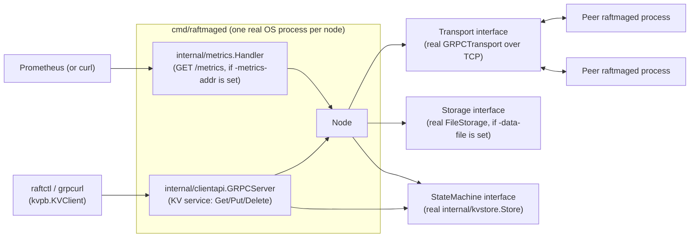

<div align="center">

# RaftMage

**A distributed key-value store built from scratch in Go, implementing the Raft consensus algorithm.**

[](go.mod)
[](https://github.com/KayBee1880/RaftMage/actions/workflows/ci.yml)
[](LICENSE)
[](docs/architecture.md)

*Every claim in this README is either true right now (verifiable with the commands below) or explicitly marked planned.*

</div>

## What this is

RaftMage is a small, from-scratch distributed key-value store. For infrastructure like this, the `Get`/`Put`/`Delete` API isn't really the product; the guarantee behind it is the product: that a write the cluster acknowledges survives node crashes, leader failures, and network partitions without being lost or silently contradicted. Raft, the consensus algorithm this project implements from first principles, is what makes that guarantee real instead of aspirational. Everything here is built and tested to prove the guarantee holds, not just to look like it does.

## Why this project exists

A single-node key-value store is easy. Making it survive a crash without losing data, or without serving stale or contradictory answers during a leader failure or network partition, is the actual problem distributed databases exist to solve, and it's provably impossible to solve perfectly, only to engineer a deliberate, defensible tradeoff for. RaftMage exists to build and prove one specific, well-understood answer to that problem at a small enough scale that every line of the consensus logic can be read, tested, and explained.

See [docs/architecture.md](docs/architecture.md) for the full design rationale, including why Raft was chosen and how the pieces fit together.

## Engineering approach

Principles this build has actually practiced, each one checkable against the commit history or the code itself, not aspirational:

- **No invented numbers.** Every count in this README (tests, components) comes straight from running `go test`/reading the code, not an estimate.
- **Reasoning is documented as "naive approach → why it breaks → the fix,"** not just "here's the code." Design docs and code-level rationale consistently explain why a simpler approach, such as a fixed (non-randomized) election timeout, or counting replicas without Raft's current-term-only commit rule, would be unsafe or livelock the cluster, before describing what's actually implemented.
- **Safety is enforced at the core, not left to callers.** All node-state mutation goes through a single mutex-guarded path inside the `Node` type; a `*Locked` naming convention makes it explicit which internal functions assume the lock is already held, so correctness doesn't depend on every caller remembering to lock correctly.
- **Deferred and rejected scope is stated explicitly, not silently absent.** [docs/architecture.md](docs/architecture.md) tracks Implemented vs. Planned per component; the Roadmap below does the same.
- **Tests exercise real logic, not mocks pretending to be the system.** Two things still get faked where a unit test doesn't need the real thing: the network (`fakeTransport`) and, in most tests, persistence (`fakeStorage`). The consensus logic itself, including real goroutines, timers, vote counting, and log persistence, runs for real; the actual `FileStorage` implementation is tested directly against the filesystem, and the actual `GRPCTransport`/`GRPCServer` are tested directly over real TCP sockets, neither one just faked.
- **CI runs the full suite with Go's race detector** (`go test ./... -race`) on every push and pull request; concurrency bugs are a CI gate, not something caught by hoping.

## What's actually working right now

- **Leader election** (`RequestVote` RPC) implementing Raft's full safety rules: one vote per term, and a candidate's log must be at least as up to date as the voter's before it gets a vote.
- **Automatic elections**: a randomized election-timeout loop (150–300ms per node) that triggers a new election with no manual intervention, specifically to avoid every node timing out simultaneously and splitting the vote forever.
- **Leader liveness**: `AppendEntries` heartbeats every 50ms that keep a healthy elected leader in power. Proven with three real `Node` instances in a genuine election, not just asserted: `TestLeaderHeartbeatsPreventFollowerReelection`.
- **Log replication (follower side)**: consistency checking against `PrevLogIndex`/`PrevLogTerm`, truncation of conflicting entries, idempotent handling of retried/duplicate RPCs, and commit-index advancement bounded by what's actually stored locally.
- **Log replication (leader side)**: per-follower `nextIndex`/`matchIndex` tracking, immediate retry at an earlier log position on rejection, and commit-index advancement gated by Raft's current-term-only rule (a leader can only directly commit an entry from its own term, never an earlier one, no matter how widely replicated). Proven with three real `Node` instances, not just asserted: `TestLeaderReplicatesAndCommitsAcrossRealNodes`.
- **Client-facing write API (`Propose`)**: the first way to actually get a write into the cluster. Rejected outright on a non-leader (`isLeader == false`, so a client knows to look elsewhere), otherwise appended to the leader's log and replicated immediately rather than waiting for the next 50ms heartbeat tick. A single-node cluster commits its own proposal instantly, since the leader alone is already a majority.
- **Crash recovery**: `currentTerm`, `votedFor`, and the log are persisted to disk (`FileStorage`, an atomic JSON snapshot per write, using a temp file, `fsync`, and rename, so a crash mid-write can never corrupt the on-disk state) before a node responds to any RPC that depends on that state surviving a restart: granting a vote, replicating an entry, or accepting a client's `Propose`. A restarted node reloads its term, vote, and log from disk instead of starting blank, which is what actually makes it safe to keep participating in the cluster afterward rather than risking a repeated vote or a forgotten entry.
- **Log compaction (`Node.Compact`)**: trims committed log entries a node no longer needs to keep in memory or on disk, replacing them with a `(lastIncludedIndex, lastIncludedTerm)` boundary the rest of the code treats as a normal (if unusually old) log position. Bounded only by `commitIndex`, matching standard Raft: any node, leader or follower, may compact anything it knows is committed, whether or not every peer has caught up to that point. When a `StateMachine` is attached and caught up, `Compact` also captures a real serialized snapshot of it (see the state machine row below), not just log metadata anymore.
- **`InstallSnapshot` RPC**: what makes the compaction rule above safe. When a leader's `replicatePeer` discovers a follower's `nextIndex` has fallen behind the leader's own `lastIncludedIndex`, meaning it can no longer explain that follower's log position through ordinary `AppendEntries`, it sends an `InstallSnapshot` instead: the boundary *and* the leader's own captured state-machine snapshot, adopted directly, followed immediately by ordinary replication for everything after it. A follower that already has entries consistent with the offered boundary keeps them rather than discarding needlessly, the Raft paper's retain trailing entries optimization. Proven end-to-end with three real nodes, one deliberately disconnected before any entries are proposed, then reconnected after the leader has compacted well past what it ever received: `TestLeaderInstallsSnapshotToCatchUpFarBehindFollower`.
- **Real gRPC transport**: `GRPCTransport`/`GRPCServer` (`internal/transport`) implement the exact same `Transport` interface the consensus core already depends on, backed by real `google.golang.org/grpc` clients and servers instead of an in-process fake. Every RPC's wire format is generated from a `.proto` definition, not hand-rolled. Proven with three real nodes electing a leader and replicating a committed write over actual TCP sockets, not just an in-process call: `TestThreeNodeClusterElectsLeaderAndReplicatesOverRealGRPC`.
- **Cluster membership changes (`Node.AddServer`/`Node.RemoveServer`)**: adds or removes one server at a time, the standard simplification (from Ongaro's Raft thesis) that avoids needing full joint consensus, since any two configurations differing by one member always share an overlapping majority. A configuration change is just another log entry (`EntryConfig`), replicated, retried, and committed by the exact same code path as an ordinary write, adopted the instant it's appended, not only once committed, per Raft's own rule. A leader that commits its own removal steps down automatically. Proven with real, concurrently-running nodes both growing a cluster (`TestLeaderAddsServerAndReplicatesToNewMember`, a brand new node joins and catches up on replication) and shrinking one (`TestLeaderRemovesFollowerAndContinuesOperating`, the remaining nodes keep functioning correctly).
- **Fault-injection testing (`internal/sim`)**: `SimTransport` wraps real `Node`s in a seeded random fault injector, random per-message delay, random message drops, and node isolation/restore, so a fixed seed reproduces the same aggregate fault behavior across runs. Not a virtual-time deterministic simulator (real goroutines and real wall-clock scheduling still introduce some nondeterminism in exactly which message draws which random outcome, an honestly stated gap, not a claim this project makes); see [docs/architecture.md](docs/architecture.md) for the precise boundary. Its flagship test, `TestClusterMaintainsSafetyUnderRandomFaults`, runs a real 5-node cluster for 3 seconds under continuous random delay, drops, and single-node isolation while proposing writes, and checks two Raft safety properties on every poll, not just at the end: election safety (never two leaders in the same term) and state machine safety (no two nodes ever disagree about a committed entry).
- **Observability (structured logs + metrics)**: `Node.SetLogger` attaches a standard-library `*slog.Logger` (nil by default, so every existing test is unaffected) that emits one structured log line per state transition, elections starting/won/lost, votes granted/denied with a reason, stepping down to follower, log compaction, snapshot installs, membership changes, proposed entries, never on routine per-heartbeat traffic. `Node.Metrics()` returns a small counter snapshot (elections, votes, entries proposed/committed, compactions, snapshots installed, membership changes) incremented at the same points. `cmd/raftmaged` is the first real, non-test consumer of `SetLogger`; `internal/metrics.Handler` (below) is the first for `Metrics()`.
- **State machine (`internal/kvstore.Store`)**: a real, in-memory key-value store, `Put`/`Delete` commands JSON-encoded into the same opaque `[]byte` `Propose` already accepted, applied to every node's own store the instant an entry commits (`Node.SetStateMachine`, nil by default, no existing test affected). `StateMachine` also has `Snapshot()`/`Restore()`, so `Compact` captures a real snapshot and `InstallSnapshot` carries it to a far-behind follower, and a node that restarts after ever compacting restores its own state machine from disk too, closing what was originally a deliberately scoped, named gap in a follow-up milestone rather than left open. Proven end to end across three real, concurrently-running nodes, each with its own independent store that has to converge without sharing memory: `TestLeaderAppliesProposedEntriesToStateMachineAcrossRealNodes`.
- **Client API (gRPC `Get`/`Put`/`Delete`, `internal/clientapi`)**: the first network surface for anything outside the cluster's own peers, a genuinely separate `KV` gRPC service from the peer-to-peer `Raft` one, wire format generated from its own `.proto` file. `Put`/`Delete` call `Propose` and then wait for the entry to actually be applied (`Node.LastApplied()` reaching the proposed index), not just accepted by the leader, so a successful reply means the same thing this project's own stated guarantee means everywhere else. Rejected on a non-leader with a `codes.FailedPrecondition` status naming `Node.CurrentLeader()` (a new accessor, tracking the last known leader from every legitimate `AppendEntries`/`InstallSnapshot`/election win) as a retry hint when one is known. Uses the caller's own gRPC request context for cancellation, a `codes.DeadlineExceeded` status if it expires before commitment, rather than inventing a fixed timeout the way the peer transport layer had to. `Get` reads directly from the local node's attached store, no leader check, no waiting, an explicitly eventually-consistent read, matching `internal/kvstore`'s own already-stated limitation, not a stronger guarantee than what's actually implemented. Proven end to end with three real nodes and a real gRPC client reaching a real leader over TCP: `TestThreeNodeClusterCommitsPutOverRealGRPCClientAPI`.
- **A real, runnable server binary (`cmd/raftmaged`)**: reads `-id`/`-raft-addr`/`-client-addr`/`-peers`/`-data-file`/`-metrics-addr` flags (or a single `-config` JSON file in place of all of them), wires up a real `*raft.Node` with its peer `Transport`, `Storage`, and `StateMachine`, starts the peer-to-peer `Raft` gRPC server, the client-facing `KV` gRPC server, and (when `-metrics-addr` is set) an HTTP metrics endpoint, calls `Node.Run()`, and shuts down gracefully on `SIGINT`/`SIGTERM`. This is the first thing in this project runnable with `go run`, not just `go test`.
- **A CLI client (`cmd/raftctl`)**: a small binary wrapping `kvpb.KVClient` for `get`/`put`/`delete` from a terminal against a running `raftmaged` instance, so poking at a live cluster no longer needs `grpcurl` and a `.proto` file passed by hand.
- **gRPC reflection**: both `raftmaged` gRPC servers (peer-to-peer `Raft` and client-facing `KV`) register the standard reflection service, so a generic tool like `grpcurl` can discover their methods and message shapes at runtime without the `.proto` files.
- **A Prometheus-format metrics endpoint (`internal/metrics`)**: `-metrics-addr` on `raftmaged` serves `Node.Metrics()`'s nine counters as plain-text Prometheus exposition format (`# HELP`/`# TYPE` comments, `raftmage_*_total` counter names), hand-rolled against the standard library alone, no new dependency, scrapeable by a real Prometheus instance today.
- **164 tests, all passing** (105 in `internal/raft`, 10 in `internal/kvstore`, 4 in `internal/storage`, 7 in `internal/transport`, 8 in `internal/sim`, 8 in `internal/clientapi`, 3 in `internal/metrics`, 14 in `cmd/raftmaged`, 5 in `cmd/raftctl`), run automatically on every push and pull request via GitHub Actions (`go build`, `go vet`, `go test -race`).

A cluster can now be started, written to, read from, and scraped for metrics as a real, standalone process, not just inside Go's test runner. See Roadmap.

## Architecture

**Current state**: what's really running today. `cmd/raftmaged` is a real, standalone binary now: run one instance per node (see Local setup below for exact commands), each wired up with a real peer `Transport` (`GRPCTransport`/`GRPCServer`, real `google.golang.org/grpc` sockets), a real `Storage` (`FileStorage`, when `-data-file` is given), a real `StateMachine` (`internal/kvstore.Store`), a real client-facing `KV` service (`internal/clientapi.GRPCServer`, a second, separate gRPC service from the peer-to-peer one), and, when `-metrics-addr` is set, a real HTTP endpoint serving `internal/metrics.Handler`. Both gRPC servers register reflection, so a generic tool can discover them without a `.proto` file in hand; `cmd/raftctl` is the bundled client that talks to the `KV` service directly. Every internal component this diagram shows has existed since an earlier milestone; what's new is that a real OS process, not Go's test runner, is what starts and stops them now.



**Target state**: the diagram above *is* the target state for a single-group cluster now, not an aspiration shown for direction, the `cmd/raftmaged` milestone was the last piece of it. The one remaining gap beyond this diagram is sharding, splitting the keyspace across more than one independent Raft group, an explicit stretch goal past the core single-group KV store this project set out to build, not something the diagram above was ever meant to show.

## Tech stack

**In use today**

| Component | Why |
|---|---|
| Go 1.26 | Goroutines/channels map directly onto Raft's concurrent RPC fan-out and per-role background timers; strong static typing catches a class of consensus bugs at compile time. |
| Go's standard `testing` package | Sufficient for the current unit + integration test needs; no external framework justified yet. |
| gRPC + Protocol Buffers | `internal/transport`'s real `GRPCTransport`/`GRPCServer` (peer-to-peer, `internal/transport/raftpb/raft.proto`) and `internal/clientapi`'s real `GRPCServer` (client-facing `KV` service, `internal/clientapi/kvpb/kv.proto`), two genuinely separate services generated from two separate `.proto` files, sharing nothing but the toolchain. |
| GitHub Actions | Free, native CI for a GitHub-hosted repo; runs build, `vet`, and race-detector tests on every push/PR. |
| Go's standard `math/rand` (seeded) | `internal/sim`'s `SimTransport` draws every fault-injection decision (delay, drop) from one seeded `*rand.Rand`, so a fixed seed reproduces the same aggregate fault behavior without needing an external fuzzing framework. |
| Go's standard `log/slog` | `Node.SetLogger` accepts a `*slog.Logger` directly, no custom logging interface invented; structured, leveled logging with pluggable output handlers (text, JSON, or a custom one) comes from the standard library alone. |
| Go's standard `encoding/json` | `internal/kvstore`'s `Command`/`Op` encoding, `cmd/raftmaged`'s own `-config` file format, the same reasoning `internal/storage.FileStorage` already chose JSON for: human-readable, standard-library only, and fast enough at this project's scale. |
| Go's standard `net/http` | `internal/metrics.Handler`, a hand-rolled Prometheus text-exposition-format endpoint; no metrics client library taken on, since the format itself is simple enough to write directly against the standard library. |

**Planned**

| Component | Milestone |
|---|---|
| Virtual-time deterministic simulator | A distinct, larger step past `internal/sim`'s current seeded-fault-injection-over-real-time approach |
| Structured log shipping (to a log aggregator) | `Node.SetLogger` already emits structured `log/slog` output; nothing yet ships it anywhere beyond `cmd/raftmaged`'s own stdout |

## Roadmap

- [x] Raft node core state (roles, terms, log)
- [x] Leader election (`RequestVote` RPC, full safety rules)
- [x] Randomized election-timeout loop (automatic elections)
- [x] `AppendEntries` heartbeats (leader liveness)
- [x] Log replication, follower side (consistency check, append/truncate, commit index)
- [x] Log replication, leader side (`nextIndex`/`matchIndex`, retry, commit advancement)
- [x] Client-facing write API (`Propose`)
- [x] Persistent write-ahead log + crash recovery
- [x] Log compaction (bounded only by `commitIndex`, matching standard Raft)
- [x] `InstallSnapshot` RPC (catch up a follower that's fallen behind the compaction point)
- [x] Real gRPC transport
- [x] Cluster membership changes (`AddServer`/`RemoveServer`, one server at a time)
- [x] Fault-injection testing (`internal/sim`'s seeded `SimTransport` + safety-invariant checking; a full virtual-time deterministic simulator remains a distinct, larger future step)
- [x] Observability (structured logs via `log/slog`, `Node.Metrics()` counters; not yet exposed externally, no service exists to expose them from)
- [x] State machine (`internal/kvstore.Store`, applied on every ordinary commit)
- [x] `InstallSnapshot` real state-machine payload (`StateMachine.Snapshot`/`Restore`, `Compact` captures it, the RPC carries it; also fixed a related gap, restoring the state machine after a restart that followed compaction)
- [x] Client API (gRPC `Get`/`Put`/`Delete`, `internal/clientapi`; waits for real commitment, not just leader acceptance, and gives a rejected write a `Node.CurrentLeader()` retry hint)
- [x] `cmd/` entrypoint (`cmd/raftmaged`, a real, runnable server binary configured entirely via CLI flags; graceful shutdown on `SIGINT`/`SIGTERM`)
- [ ] Sharding (stretch goal, past the core single-group KV store) ← current, and the only remaining item

Fuller status, including what's implemented vs. planned per component: [docs/architecture.md](docs/architecture.md).

## Repository structure

Reflects the actual current tree; nothing listed here that doesn't exist yet.

```
raftmage/
├── go.mod
├── Makefile
├── LICENSE
├── README.md
├── docs/
│   └── architecture.md
├── .github/workflows/
│   └── ci.yml
├── cmd/
│   ├── raftmaged/           # the real, runnable server binary
│   │   ├── main.go          # flags/config file -> Node + Transport + Storage + StateMachine + all servers
│   │   └── main_test.go     # 14 tests, covering parsePeers, resolveConfig, loadConfigFile
│   └── raftctl/             # a small CLI client for a running raftmaged instance
│       ├── main.go          # get/put/delete over kvpb.KVClient
│       └── main_test.go     # 5 tests, including a round trip over a real gRPC server
└── internal/
    ├── raft/                    # the consensus core
    │   ├── raft.go              # Node state: roles, terms, log
    │   ├── election.go          # RequestVote RPC, leader election
    │   ├── election_timer.go    # randomized election-timeout loop
    │   ├── append_entries.go    # AppendEntries RPC: heartbeats + log replication (both sides)
    │   ├── propose.go           # Propose: the client-facing write API
    │   ├── compact.go           # Node.Compact: log compaction, bounded only by commitIndex
    │   ├── install_snapshot.go  # InstallSnapshot RPC: catches up a far-behind follower
    │   ├── membership.go        # AddServer/RemoveServer: one-server-at-a-time cluster membership changes
    │   ├── observability.go     # SetLogger (log/slog) + Metrics() counters
    │   ├── state_machine.go     # StateMachine interface + the apply loop (commit -> applied)
    │   ├── transport.go         # Transport interface: the network dependency-inversion boundary
    │   ├── storage.go           # Storage interface: the persistence dependency-inversion boundary
    │   └── *_test.go            # 105 tests, including seven 3-node integration tests
    ├── kvstore/                 # the real, in-memory StateMachine implementation
    │   ├── store.go             # Store: Put/Delete key-value store, JSON command encoding, Snapshot/Restore
    │   └── store_test.go        # 10 tests
    ├── storage/                 # the real, disk-backed Storage implementation
    │   ├── file_storage.go      # FileStorage: atomic JSON-snapshot persistence to disk
    │   └── file_storage_test.go # 4 tests
    ├── transport/               # the real, network-backed Transport implementation
    │   ├── raftpb/
    │   │   ├── raft.proto       # wire format for RequestVote/AppendEntries/InstallSnapshot
    │   │   ├── raft.pb.go       # generated by protoc, not hand-written
    │   │   └── raft_grpc.pb.go  # generated by protoc, not hand-written
    │   ├── client.go            # GRPCTransport: satisfies raft.Transport over real gRPC
    │   ├── server.go            # GRPCServer: dispatches incoming RPCs to a real *raft.Node, reflection registered
    │   └── *_test.go            # 7 tests, including a 3-node cluster over real TCP sockets
    ├── sim/                     # seeded fault-injecting Transport, for chaos testing
    │   ├── transport.go         # SimTransport: satisfies raft.Transport with random delay/drop/isolation
    │   └── *_test.go            # 8 tests, including a 5-node safety-invariant chaos test
    ├── clientapi/                # the client-facing gRPC service (Get/Put/Delete), separate from peer-to-peer transport
    │   ├── kvpb/
    │   │   ├── kv.proto          # wire format for the KV service: Get/Put/Delete
    │   │   ├── kv.pb.go          # generated by protoc, not hand-written
    │   │   └── kv_grpc.pb.go     # generated by protoc, not hand-written
    │   ├── server.go             # GRPCServer: Propose + wait for commitment, structured gRPC status errors, reflection registered
    │   └── *_test.go             # 8 tests, including a 3-node cluster with a real client over real TCP sockets
    └── metrics/                  # HTTP handler exposing Node.Metrics() in Prometheus text format
        ├── handler.go            # Handler: GET /metrics -> raftmage_*_total counters
        └── handler_test.go       # 3 tests
```

`go run ./cmd/raftmaged -id=... -raft-addr=... -client-addr=... -peers=...` (or `-config=node.json`) is now a real, runnable command; see Local setup below for a full three-node example, including `raftctl` and the metrics endpoint.

## Local setup

Requires Go 1.26+. Every command below has been run against this exact repo state.

```
go build ./...
go vet ./...
go test ./...
```

Or, on a system with `make`:

```
make build
make vet
make test
```

`make race` / `go test ./... -race` requires a cgo-capable toolchain. Works in CI, may not work on every local machine.

Every capability above, individually proven through the test suite: three real nodes electing a leader, staying stable under it, and replicating and committing a real client write via `Propose`, end to end (a real multi-process cluster demo, no test runner involved, follows in the next section):

```
go test ./internal/raft -run TestLeaderHeartbeatsPreventFollowerReelection -v
go test ./internal/raft -run TestLeaderReplicatesAndCommitsAcrossRealNodes -v
go test ./internal/raft -run TestLeaderCompactsLogSafelyWithoutStrandingFollowers -v
go test ./internal/raft -run TestLeaderInstallsSnapshotToCatchUpFarBehindFollower -v
go test ./internal/transport -run TestThreeNodeClusterElectsLeaderAndReplicatesOverRealGRPC -v
go test ./internal/raft -run TestLeaderAddsServerAndReplicatesToNewMember -v
go test ./internal/raft -run TestLeaderRemovesFollowerAndContinuesOperating -v
go test ./internal/sim -run TestClusterMaintainsSafetyUnderRandomFaults -v
go test ./internal/raft -run TestSetLoggerReceivesVoteGrantedLog -v
go test ./internal/raft -run TestLeaderAppliesProposedEntriesToStateMachineAcrossRealNodes -v
go test ./internal/clientapi -run TestThreeNodeClusterCommitsPutOverRealGRPCClientAPI -v
go test ./cmd/raftctl -run TestRunCommandPutThenGetRoundTripsOverRealGRPC -v
go test ./internal/metrics -run TestHandlerWritesCurrentCounterValues -v
```

The last command's own test output includes a real `log/slog` structured log line (`node=... term=... role=... candidate=... msg="granted vote"`), the smallest possible look at what `Node.SetLogger` actually produces.

## Running a real cluster

`cmd/raftmaged` is a real binary now, not something proven only through `go test`. Three terminals, three instances, forming a real three-node cluster over localhost, each also serving Prometheus-format metrics on its own `-metrics-addr`:

```
# terminal 1
go run ./cmd/raftmaged -id=node-1 -raft-addr=127.0.0.1:9001 -client-addr=127.0.0.1:9101 -metrics-addr=127.0.0.1:9201 \
  -peers=node-2=127.0.0.1:9002,node-3=127.0.0.1:9003

# terminal 2
go run ./cmd/raftmaged -id=node-2 -raft-addr=127.0.0.1:9002 -client-addr=127.0.0.1:9102 -metrics-addr=127.0.0.1:9202 \
  -peers=node-1=127.0.0.1:9001,node-3=127.0.0.1:9003

# terminal 3
go run ./cmd/raftmaged -id=node-3 -raft-addr=127.0.0.1:9003 -client-addr=127.0.0.1:9103 -metrics-addr=127.0.0.1:9203 \
  -peers=node-1=127.0.0.1:9001,node-2=127.0.0.1:9002
```

Each of the three lines above can equally be `go run ./cmd/raftmaged -config=node-1.json`, a JSON file with `id`/`raft_addr`/`client_addr`/`peers`/`data_file`/`metrics_addr` keys, instead of individual flags.

Each instance's own `log/slog` output shows its election activity; within a few hundred milliseconds one of the three logs "won election". Both gRPC servers now register reflection, so a plain `grpcurl` call needs no `.proto` file, against whichever address logged the win:

```
grpcurl -plaintext -d '{"key":"foo","value":"YmFy"}' 127.0.0.1:9101 kvpb.KV/Put
```

Or the bundled CLI client, which does the base64 encoding for you:

```
go run ./cmd/raftctl -addr=127.0.0.1:9101 put foo bar
go run ./cmd/raftctl -addr=127.0.0.1:9101 get foo
```

And the metrics endpoint, plain `curl`:

```
curl http://127.0.0.1:9201/metrics
```

Ctrl-C any instance to see the graceful shutdown log line and a real re-election among the remaining two.

## Documentation

- [docs/architecture.md](docs/architecture.md): system design, component status, and diagrams.

## License

[MIT](LICENSE)
