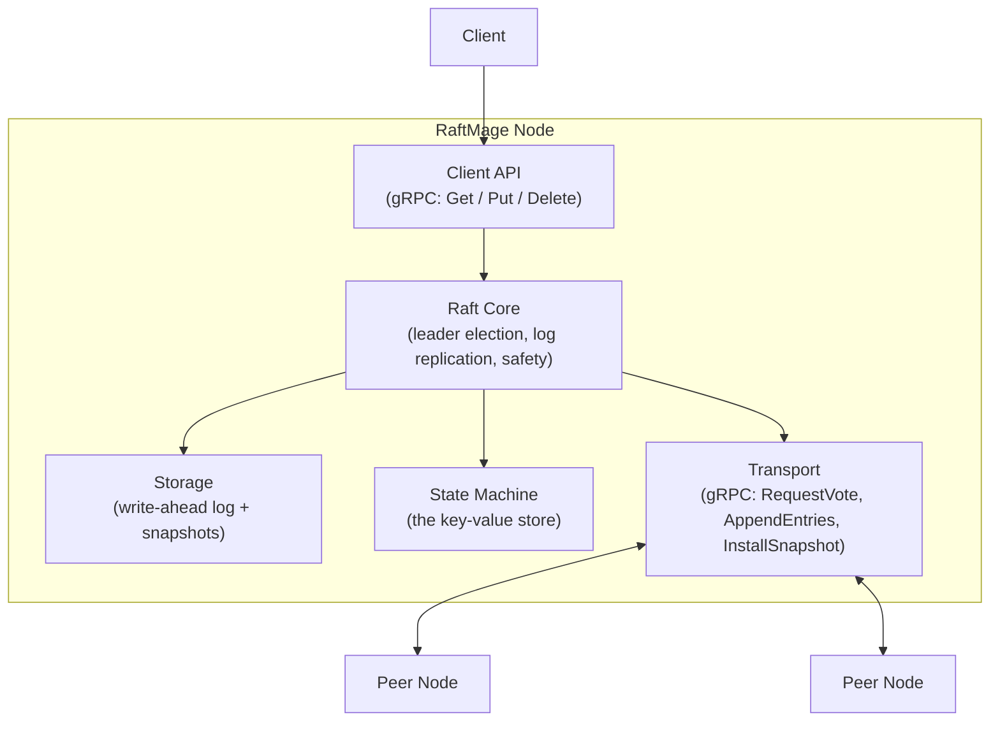
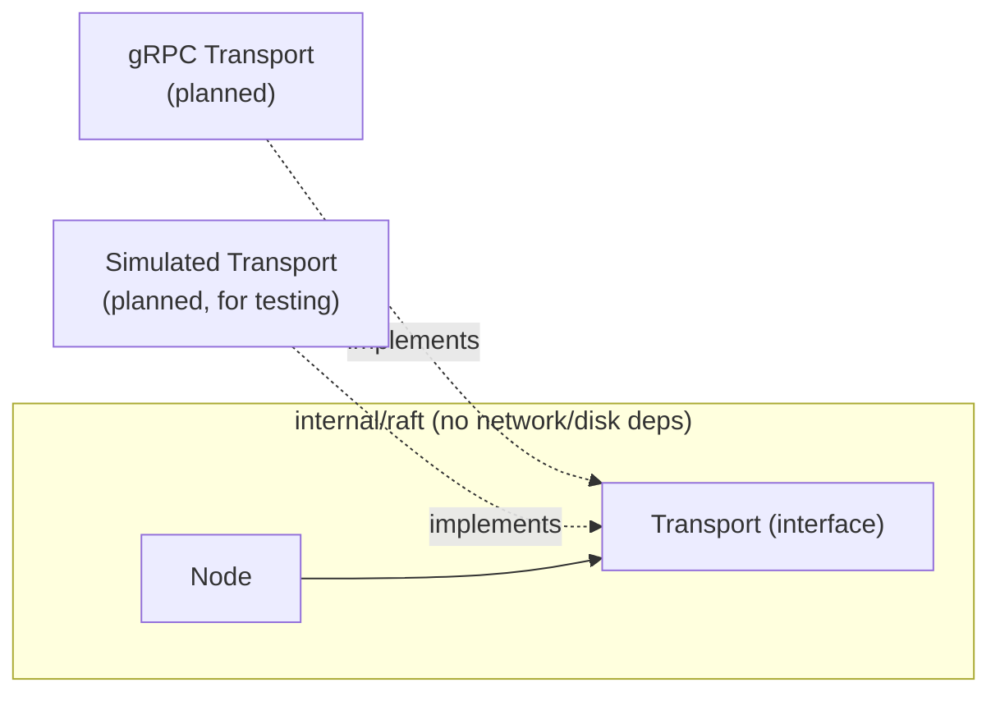
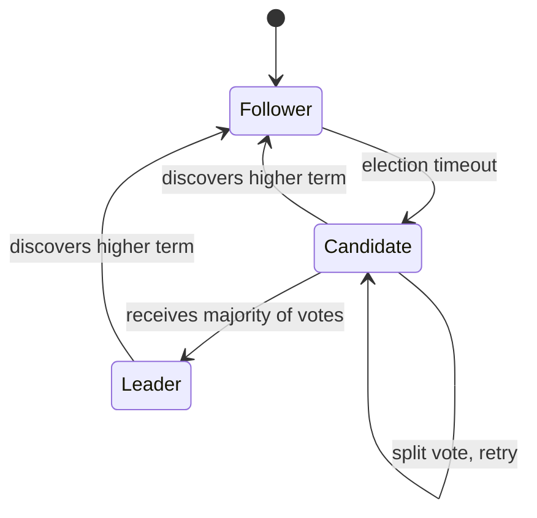

# Architecture

## Overview

RaftMage is a distributed key-value store that uses the Raft consensus algorithm to keep multiple replicas of the same data in agreement, even when nodes crash or the network partitions. This document describes the target architecture and tracks which parts are implemented today versus planned.

## Component diagram



| Component | Status |
|---|---|
| Raft Core (roles, terms, leader election, randomized election timeout) | Implemented |
| AppendEntries — heartbeats | Implemented |
| AppendEntries — log entry replication (follower side: consistency check, append/truncate, commit index) | Implemented |
| AppendEntries — log entry replication (leader side: nextIndex/matchIndex, retry, commit advancement) | Planned |
| Client-facing write API (`Propose`) | Planned |
| Storage (WAL + snapshots) | Planned |
| State Machine (KV store) | Planned |
| Transport (real gRPC) | Planned — election and heartbeats currently run over an injected `Transport` interface (an in-process fake in unit tests, a loopback implementation in the multi-node integration test), not real network calls |
| Client API | Planned |

## Raft core dependency direction

The Raft core (`internal/raft`) depends only on interfaces it defines itself (`Transport`) — it has no import on gRPC, no import on any storage package. Concrete implementations of those interfaces get wired in from outside the package (dependency injection), which keeps the consensus logic testable without a real network and, later, drivable by a deterministic simulation harness that can inject network delay, message loss, and partitions.



## Node role state machine

Every node is in exactly one of three roles at any time.



`Node.Run()` starts a background goroutine (`runElectionTimer`) that fires `StartElection` automatically once a randomized timeout (150–300ms) elapses without the node hearing from a leader or granting a vote. `Run()` is opt-in — unit tests construct nodes and drive transitions manually without ever calling it, so the extensive test suite stays deterministic and doesn't race against background timers.

Winning an election now also starts a heartbeat loop (`runHeartbeats`): the leader sends an empty `AppendEntries` to every peer every 50ms, well under the election-timeout floor. A follower receiving a valid heartbeat resets its own election clock, the same as granting a vote does — this is what keeps a healthy leader in power instead of its followers eventually timing out and forcing needless re-elections. Proven end-to-end (not just unit-tested) by `TestLeaderHeartbeatsPreventFollowerReelection`, which runs three real nodes over an in-process loopback transport and confirms the elected leader stays leader across multiple election-timeout windows.

`AppendEntries` now carries real `PrevLogIndex`/`PrevLogTerm`/`Entries`/`LeaderCommit` fields, and `HandleAppendEntries` implements the full log matching property on the receiving end: rejects entries that don't line up with the follower's existing log, truncates and overwrites conflicting entries, and advances the follower's commit index as the leader reports progress. What's still missing is entirely on the *sending* side — nothing yet tracks each follower's replication progress (`nextIndex`/`matchIndex`), retries a rejected append at an earlier log position, or lets a client actually propose a write in the first place. `sendHeartbeats` today only ever sends empty entries; the receiving logic is ready for real ones the moment the leader side catches up.

## Package layout

Only what currently exists; more packages get added as later milestones need them.

```
raftmage/
  internal/raft/     Raft consensus core — Node, roles, RequestVote/AppendEntries RPCs, election, heartbeats
  docs/               This document and future design docs
  private/            Gitignored personal study notes (mirrors real file paths)
```
