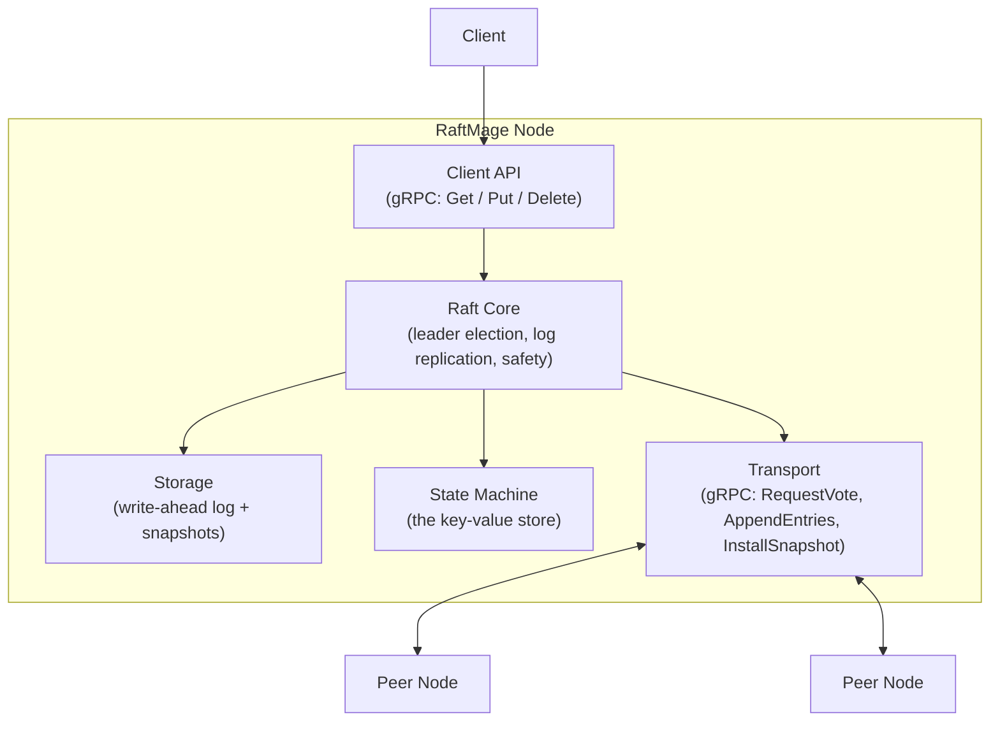
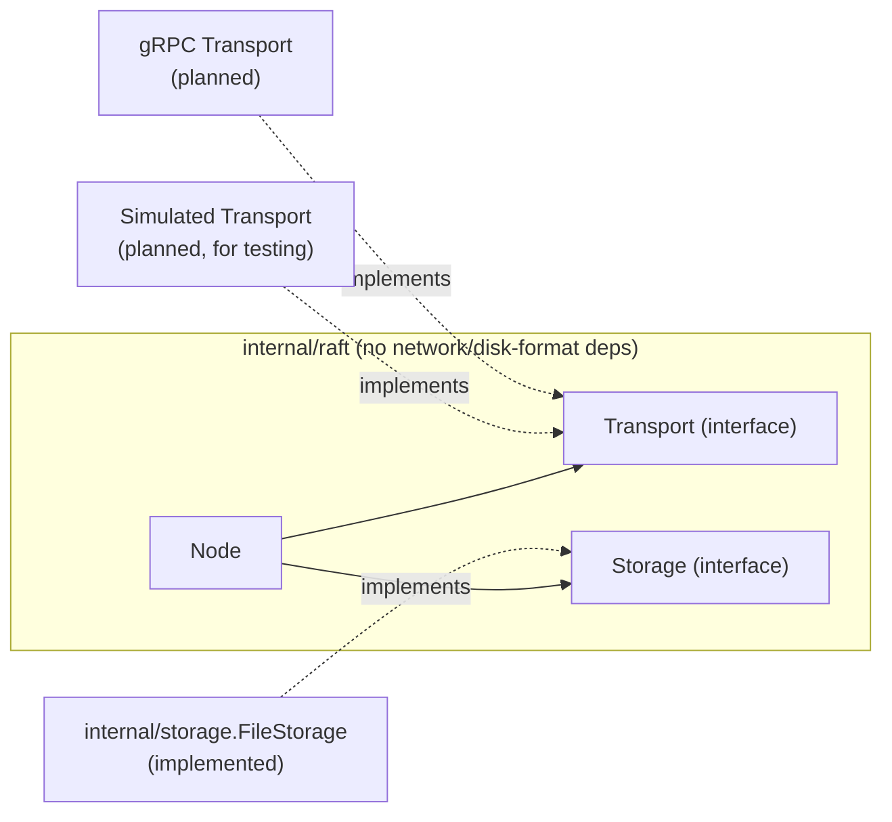
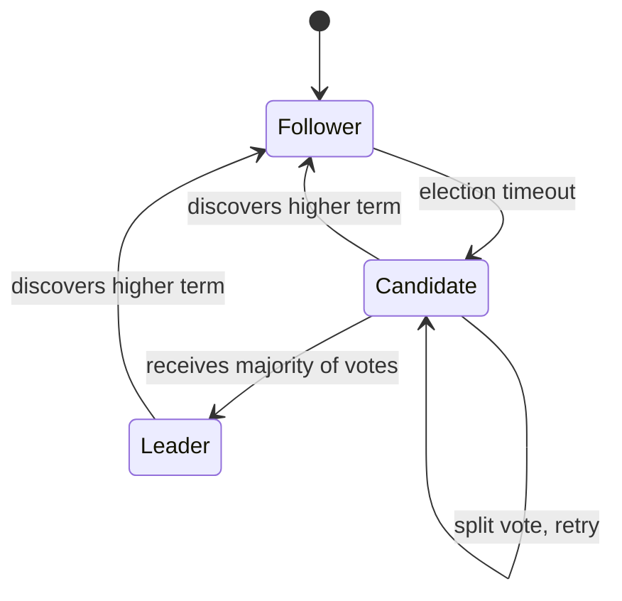

# Architecture

## Overview

RaftMage is a distributed key-value store that uses the Raft consensus algorithm to keep multiple replicas of the same data in agreement, even when nodes crash or the network partitions. This document describes the target architecture and tracks which parts are implemented today versus planned.

## Component diagram



| Component | Status |
|---|---|
| Raft Core (roles, terms, leader election, randomized election timeout) | Implemented |
| AppendEntries — heartbeats | Implemented |
| AppendEntries — log entry replication (follower side: consistency check, append/truncate, commit index) | Implemented |
| AppendEntries — log entry replication (leader side: nextIndex/matchIndex, retry, commit advancement) | Implemented |
| Client-facing write API (`Propose`) | Implemented — internal `Node.Propose` only, not yet exposed over a network API (see `Client API` row below) |
| Storage (crash-safe persistence) | Implemented — `currentTerm`/`votedFor`/`log` persisted as an atomic JSON snapshot per write (`FileStorage`); this is durable, crash-safe persistence, not yet a true incremental append-only WAL or log compaction/snapshotting (still Planned — see README's Roadmap) |
| State Machine (KV store) | Planned |
| Transport (real gRPC) | Planned — election and heartbeats currently run over an injected `Transport` interface (an in-process fake in unit tests, a loopback implementation in the multi-node integration test), not real network calls |
| Client API | Planned |

## Raft core dependency direction

The Raft core (`internal/raft`) depends only on interfaces it defines itself (`Transport`, `Storage`) — it has no import on gRPC, no import on any specific disk format. Concrete implementations of those interfaces get wired in from outside the package (dependency injection), which keeps the consensus logic testable without a real network or a real disk and, later, drivable by a deterministic simulation harness that can inject network delay, message loss, partitions, and (now that `Storage` exists as its own seam) disk faults.



## Node role state machine

Every node is in exactly one of three roles at any time.



`Node.Run()` starts a background goroutine (`runElectionTimer`) that fires `StartElection` automatically once a randomized timeout (150–300ms) elapses without the node hearing from a leader or granting a vote. `Run()` is opt-in — unit tests construct nodes and drive transitions manually without ever calling it, so the extensive test suite stays deterministic and doesn't race against background timers.

Winning an election now also starts a heartbeat loop (`runHeartbeats`): the leader sends an empty `AppendEntries` to every peer every 50ms, well under the election-timeout floor. A follower receiving a valid heartbeat resets its own election clock, the same as granting a vote does — this is what keeps a healthy leader in power instead of its followers eventually timing out and forcing needless re-elections. Proven end-to-end (not just unit-tested) by `TestLeaderHeartbeatsPreventFollowerReelection`, which runs three real nodes over an in-process loopback transport and confirms the elected leader stays leader across multiple election-timeout windows.

`AppendEntries` now carries real `PrevLogIndex`/`PrevLogTerm`/`Entries`/`LeaderCommit` fields, and `HandleAppendEntries` implements the full log matching property on the receiving end: rejects entries that don't line up with the follower's existing log, truncates and overwrites conflicting entries, and advances the follower's commit index as the leader reports progress. The leader side exists too: winning an election initializes `nextIndex`/`matchIndex` for every peer, and the same periodic heartbeat loop that keeps a leader in power also drives replication — each round sends every peer whatever it's missing (nothing, for a fully caught-up follower, which is what makes a plain heartbeat and a replication attempt the same code path), retries immediately at an earlier log position whenever a follower rejects for a log inconsistency, and advances the leader's own commit index once an entry from its current term reaches a majority — Raft's specific rule that a leader may only directly commit an entry from its own term, never an earlier one, no matter how widely replicated.

What was still missing after that milestone was a way for a client to get an entry into the leader's log in the first place — that gap is closed now: `Node.Propose(command []byte) (index, term uint64, isLeader bool)` appends to the leader's own log (rejecting outright, `isLeader == false`, if called on a non-leader — Raft always resolves writes at the leader, never a follower) and immediately triggers a replication round rather than waiting for the next heartbeat tick, so a proposed write starts propagating with no added latency beyond the RPC round trips themselves. It also runs the same commit-advancement check inline before returning — the one case that needs this is a single-node cluster, whose leader is already its own majority and would otherwise never see a `replicatePeer` success reply (there are no peers to reply) to trigger a commit at all. `Propose` is still an in-process Go method, not a network RPC — the `Client API` row in the status table above (gRPC `Get`/`Put`/`Delete`) is the next layer up, still Planned, and is what would actually call `Propose` from outside the process once it exists.

Everything up to that point lived only in memory — a crash lost `currentTerm`, `votedFor`, and the entire log, which is unsafe in a very specific way: a restarted node with no memory of `votedFor` could grant a second vote in a term it already voted in, and a restarted leader with no memory of its log could tell followers to replicate entries it can no longer produce. `Node.persistStateLocked()` closes that gap by writing `currentTerm`/`votedFor`/`log` to a `Storage` implementation at exactly the points the Raft paper's Figure 2 requires — before granting a vote, before casting one as a candidate, before accepting replicated entries, and before a leader's own `Propose` call returns — and `NewNode` loads existing state back from `Storage` at construction, so a restarted node resumes from where it left off instead of starting blank. `Storage` is nil-tolerant the same way `Transport` already was (most existing unit tests pass `nil` and get no persistence at all, which is fine for tests that don't outlive a single `go test` process); `persistStateLocked` and `NewNode`'s load step both panic rather than silently continuing if a real `Storage` implementation ever fails — a Raft node that can't prove its own state is durable has no safe way to keep participating in the cluster, so failing loudly beats risking a safety violation. The real implementation, `internal/storage.FileStorage`, lives in its own package rather than inside `internal/raft` — the same reasoning as the (still-planned) gRPC `Transport`: the consensus core depends only on the `Storage` interface, never on `os`/`encoding/json` directly, so `internal/raft`'s own files stay free of disk imports and the package boundary shown in the dependency diagram above is actually true, not just asserted. `FileStorage` itself writes a full JSON snapshot per save, through a temp-file-then-atomic-rename with an explicit `fsync` before the rename — deliberately not a true incremental append-only WAL (that needs real handling for log truncation on conflicting entries, meaningfully more complex, and stays a distinct, still-Planned future step alongside snapshotting/compaction) but genuinely crash-safe today: a process killed mid-write leaves either the old, complete file or nothing (an orphaned, never-renamed `.tmp`), never a corrupted one.

## Package layout

Only what currently exists; more packages get added as later milestones need them.

```
raftmage/
  internal/raft/     Raft consensus core — Node, roles, RequestVote/AppendEntries RPCs, election, heartbeats, Propose, the Storage interface
  internal/storage/  FileStorage — the real, disk-backed Storage implementation (crash-safe JSON snapshots)
  docs/               This document and future design docs
  private/            Gitignored personal study notes (mirrors real file paths)
```
