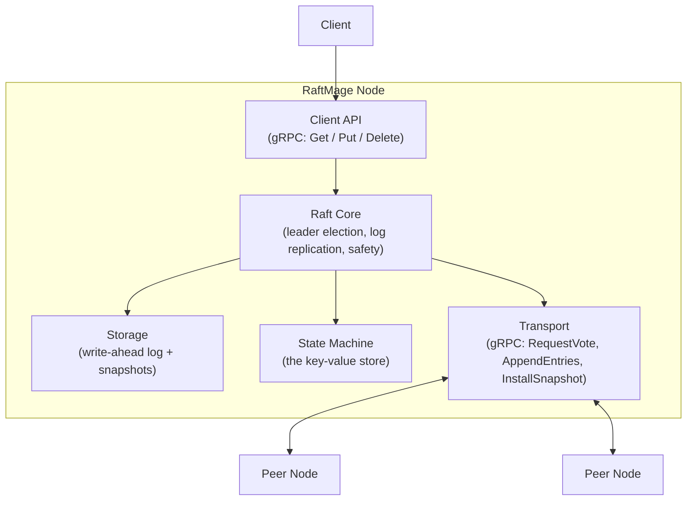
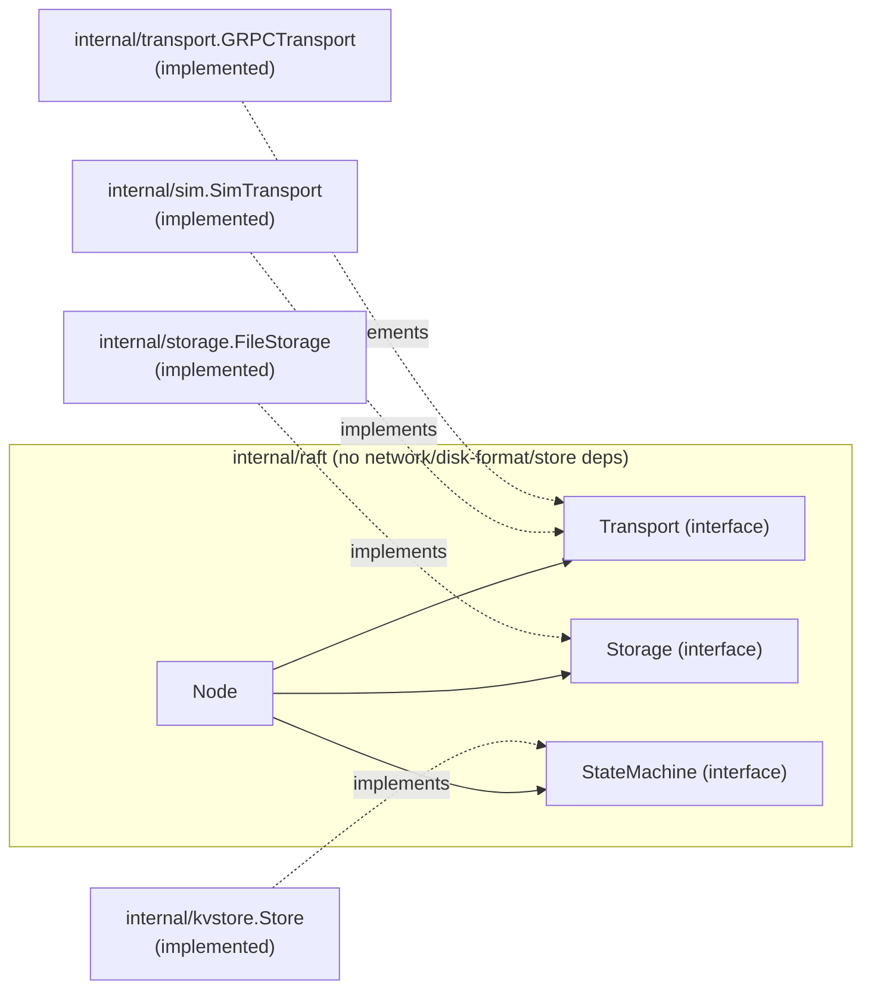
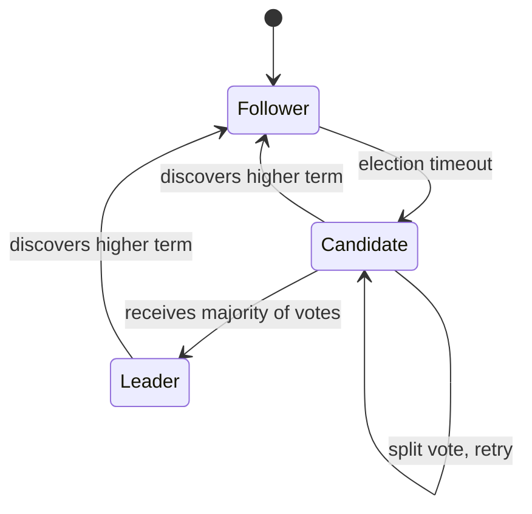

# Architecture

## Overview

RaftMage is a distributed key-value store that uses the Raft consensus algorithm to keep multiple replicas of the same data in agreement, even when nodes crash or the network partitions. This document describes the target architecture and tracks which parts are implemented today versus planned.

## Component diagram



| Component | Status |
|---|---|
| Raft Core (roles, terms, leader election, randomized election timeout) | Implemented |
| AppendEntries (heartbeats) | Implemented |
| AppendEntries (log entry replication, follower side: consistency check, append/truncate, commit index) | Implemented |
| AppendEntries (log entry replication, leader side: nextIndex/matchIndex, retry, commit advancement) | Implemented |
| Client-facing write API (`Propose`) | Implemented: internal `Node.Propose`, now called from a real network API too (see `Client API` row below), not just from inside the process |
| Storage (crash-safe persistence) | Implemented: `currentTerm`/`votedFor`/`log` persisted as an atomic JSON snapshot per write (`FileStorage`); this is durable, crash-safe persistence, not yet a true incremental append-only WAL |
| Log compaction (`Node.Compact`) | Implemented: bounded only by `commitIndex`, matching standard Raft. Any node, leader or follower, may compact anything it knows is committed, regardless of whether every peer has caught up to that point; the row below is what makes that safe. When a `StateMachine` is attached and caught up, `Compact` also captures a real serialized snapshot of it into `Node.stateMachineSnapshot`, persisted alongside `lastIncludedIndex`/`lastIncludedTerm`, no longer log metadata only |
| `InstallSnapshot` RPC | Implemented: when a leader's `replicatePeer` finds a follower's `nextIndex` has fallen behind the leader's own `lastIncludedIndex`, it sends this instead of `AppendEntries`, since it can no longer explain that follower's log position at all. Carries the boundary (`LastIncludedIndex`/`LastIncludedTerm`) and, as of the snapshot-payload milestone, the leader's own captured state-machine snapshot (`Data`), so a rescued follower's state machine, not just its log, ends up correct |
| State Machine (`internal/kvstore.Store`) | Implemented: a real in-memory key-value store (`Put`/`Delete`, JSON-encoded `Command`s riding inside the same opaque `LogEntry.Command` bytes `Propose` already accepted), applied to every node's own store the instant an entry commits (`Node.SetStateMachine`, nil-tolerant, no existing test affected). `StateMachine` also has `Snapshot()`/`Restore()`; the gap this row used to name here (a follower rescued by `InstallSnapshot` ending up with an incomplete state machine) is closed, along with a related one found while closing it: a node that restarts after ever compacting now correctly restores its state machine from the persisted snapshot too, not just a node rescued by `InstallSnapshot` |
| Transport (real gRPC) | Implemented: `internal/transport`'s `GRPCTransport`/`GRPCServer` satisfy the same `Transport` interface the consensus core already depended on, backed by real `google.golang.org/grpc` clients and servers, generated from `internal/transport/raftpb/raft.proto`, not an in-process fake. No TLS yet, and `Transport`'s method signatures still take no `context.Context`, so `GRPCTransport` bounds every call with a fixed internal timeout rather than a caller-supplied deadline; both are honest, named gaps, not oversights |
| Cluster membership changes (`Node.AddServer`/`Node.RemoveServer`) | Implemented: one server added or removed at a time (Ongaro's Raft thesis simplification, not the paper's full joint consensus), represented as an ordinary log entry and adopted the instant it's appended, not only once committed. A leader that commits its own removal steps down. Named gaps: no non-voting catch-up phase for a newly added member (it counts toward majority immediately), and no RPC-level check that a sender is still a legitimate member of the receiver's own current config |
| Fault-injection testing (`internal/sim`) | Implemented: `SimTransport` satisfies `Transport` over real `Node`s and real goroutines, injecting random per-message delay, random drops, and node isolation, every decision drawn from one seeded `*rand.Rand`. Two Raft safety properties (election safety, state machine safety) are checked continuously, not just at the end, across a real multi-node cluster running under chaos. Explicitly not a virtual-time deterministic simulator: real wall-clock scheduling means a fixed seed reproduces the same aggregate fault behavior, not necessarily which exact message consumes which random draw when multiple goroutines call concurrently, a materially weaker guarantee than true bit-for-bit determinism, stated here rather than implied by the word "seeded" alone |
| Observability (structured logs + metrics) | Implemented: `Node.SetLogger` accepts a standard-library `*slog.Logger` (nil by default, no existing test affected), emitting one structured line per state transition, not on routine heartbeat traffic. `Node.Metrics()` returns a small counter snapshot incremented at the same points. As of the `cmd/` entrypoint milestone, `cmd/raftmaged` is the first real, non-test consumer of `SetLogger` (a plain text handler to stdout), but `Metrics()` still has no consumer outside tests: no HTTP `/metrics` endpoint or equivalent exists yet |
| Client API (gRPC `Get`/`Put`/`Delete`, `internal/clientapi`) | Implemented: a genuinely separate `KV` gRPC service from the peer-to-peer `Raft` one, its own `.proto` file (`internal/clientapi/kvpb/kv.proto`). `Put`/`Delete` call `Propose` then poll `Node.LastApplied()` until the proposed index is actually applied, bounded by the incoming request's own `context.Context`, so a successful reply means real commitment, not just leader acceptance. Rejected on a non-leader with a `codes.FailedPrecondition` status naming `Node.CurrentLeader()` (new accessor) as a retry hint when known. `Get` reads the local node's attached store directly, no leader check, no waiting, an explicitly eventually-consistent read (same honest limitation `internal/kvstore.Store` already states), not linearizable. As of the `cmd/` entrypoint milestone, `cmd/raftmaged` is a real standalone process that listens on this service; see that row below |
| `cmd/` entrypoint (`cmd/raftmaged`) | Implemented: a real, runnable server binary, configured entirely through CLI flags (`-id`/`-raft-addr`/`-client-addr`/`-peers`/`-data-file`), no config file. Wires a real `*raft.Node` to its peer `Transport`, `Storage` (only when `-data-file` is given), `StateMachine`, and both gRPC servers (peer-to-peer `Raft`, client-facing `KV`), calls `Node.Run()`, and shuts down gracefully (`GracefulStop` on both servers, `Node.Stop()`) on `SIGINT`/`SIGTERM`. Named gaps, a deliberately smaller scope chosen over a larger combined option put to the user directly: no bundled CLI client (`grpcurl` or an ad hoc program is enough today), no gRPC reflection registered on either server (a `grpcurl` call needs the `.proto` file passed directly), no config file format |

## Raft core dependency direction

The Raft core (`internal/raft`) depends only on interfaces it defines itself (`Transport`, `Storage`, `StateMachine`); it has no import on gRPC, no import on any specific disk format, no import on `internal/kvstore`. Concrete implementations of those interfaces get wired in from outside the package (dependency injection), which keeps the consensus logic testable without a real network, a real disk, or a real key-value store, and, now that `internal/sim.SimTransport` exists, genuinely drivable by a fault-injecting harness that can inject network delay, message loss, and node isolation, exactly the payoff this dependency-inversion design was chosen for from the very first milestone. Disk faults have no equivalent injector yet; `Storage` existing as its own seam means one could be added the same way, without touching `internal/raft` itself, but nothing does so today.



## Node role state machine

Every node is in exactly one of three roles at any time.



`Node.Run()` starts a background goroutine (`runElectionTimer`) that fires `StartElection` automatically once a randomized timeout (150–300ms) elapses without the node hearing from a leader or granting a vote. `Run()` is opt-in: unit tests construct nodes and drive transitions manually without ever calling it, so the extensive test suite stays deterministic and doesn't race against background timers.

Winning an election now also starts a heartbeat loop (`runHeartbeats`): the leader sends an empty `AppendEntries` to every peer every 50ms, well under the election-timeout floor. A follower receiving a valid heartbeat resets its own election clock, the same as granting a vote does; this is what keeps a healthy leader in power instead of its followers eventually timing out and forcing needless re-elections. Proven end-to-end (not just unit-tested) by `TestLeaderHeartbeatsPreventFollowerReelection`, which runs three real nodes over an in-process loopback transport and confirms the elected leader stays leader across multiple election-timeout windows.

`AppendEntries` now carries real `PrevLogIndex`/`PrevLogTerm`/`Entries`/`LeaderCommit` fields, and `HandleAppendEntries` implements the full log matching property on the receiving end: rejects entries that don't line up with the follower's existing log, truncates and overwrites conflicting entries, and advances the follower's commit index as the leader reports progress. The leader side exists too: winning an election initializes `nextIndex`/`matchIndex` for every peer, and the same periodic heartbeat loop that keeps a leader in power also drives replication. Each round sends every peer whatever it's missing (nothing, for a fully caught-up follower, which is what makes a plain heartbeat and a replication attempt the same code path), retries immediately at an earlier log position whenever a follower rejects for a log inconsistency, and advances the leader's own commit index once an entry from its current term reaches a majority: Raft's specific rule that a leader may only directly commit an entry from its own term, never an earlier one, no matter how widely replicated.

What was still missing after that milestone was a way for a client to get an entry into the leader's log in the first place. That gap is closed now: `Node.Propose(command []byte) (index, term uint64, isLeader bool)` appends to the leader's own log (rejecting outright, `isLeader == false`, if called on a non-leader, since Raft always resolves writes at the leader, never a follower) and immediately triggers a replication round rather than waiting for the next heartbeat tick, so a proposed write starts propagating with no added latency beyond the RPC round trips themselves. It also runs the same commit-advancement check inline before returning. The one case that needs this is a single-node cluster, whose leader is already its own majority and would otherwise never see a `replicatePeer` success reply (there are no peers to reply) to trigger a commit at all. `Propose` is still an in-process Go method, not a network RPC; the `Client API` row in the status table above (gRPC `Get`/`Put`/`Delete`) is the next layer up, still Planned, and is what would actually call `Propose` from outside the process once it exists.

Everything up to that point lived only in memory. A crash lost `currentTerm`, `votedFor`, and the entire log, which is unsafe in a very specific way: a restarted node with no memory of `votedFor` could grant a second vote in a term it already voted in, and a restarted leader with no memory of its log could tell followers to replicate entries it can no longer produce. `Node.persistStateLocked()` closes that gap by writing `currentTerm`/`votedFor`/`log` to a `Storage` implementation at exactly the points the Raft paper's Figure 2 requires: before granting a vote, before casting one as a candidate, before accepting replicated entries, and before a leader's own `Propose` call returns. `NewNode` loads existing state back from `Storage` at construction, so a restarted node resumes from where it left off instead of starting blank. `Storage` is nil-tolerant the same way `Transport` already was (most existing unit tests pass `nil` and get no persistence at all, which is fine for tests that don't outlive a single `go test` process); `persistStateLocked` and `NewNode`'s load step both panic rather than silently continuing if a real `Storage` implementation ever fails, since a Raft node that can't prove its own state is durable has no safe way to keep participating in the cluster, so failing loudly beats risking a safety violation. The real implementation, `internal/storage.FileStorage`, lives in its own package rather than inside `internal/raft`, the same reasoning as the (still-planned) gRPC `Transport`: the consensus core depends only on the `Storage` interface, never on `os`/`encoding/json` directly, so `internal/raft`'s own files stay free of disk imports and the package boundary shown in the dependency diagram above is actually true, not just asserted. `FileStorage` itself writes a full JSON snapshot per save, through a temp-file-then-atomic-rename with an explicit `fsync` before the rename. It's deliberately not a true incremental append-only WAL (that needs real handling for log truncation on conflicting entries, meaningfully more complex, and stays a distinct future step) but is genuinely crash-safe today: a process killed mid-write leaves either the old, complete file or nothing (an orphaned, never-renamed `.tmp`), never a corrupted one.

An unbounded log is still a real problem `FileStorage` alone doesn't solve: every save re-marshals and re-writes the *entire* log, so the cost of persisting grows with total history, not with what's actually new. `Node.Compact(upToIndex uint64)` addresses that by discarding entries a node no longer needs to keep around, replacing them with two numbers, `lastIncludedIndex` and `lastIncludedTerm`, that every index-arithmetic helper in the package (`lastLogIndexLocked`, `logTermAtLocked`, `appendNewEntriesLocked`, `replicatePeer`'s log slicing) now treats as an offset rather than assuming the log always starts at Raft index 1. `Compact` is bounded only by `commitIndex`, matching standard Raft: any node may compact anything it knows is committed, whether or not every peer has caught up to that point. Proven against three real nodes, not just unit-tested: `TestLeaderCompactsLogSafelyWithoutStrandingFollowers`, which replicates and commits entries, compacts the leader's log once it's safe to, then proposes and successfully replicates *another* entry afterward, confirming compaction doesn't quietly break the replication path it shares helpers with.

Compacting past a slow follower's progress raises an obvious question: what happens when that follower is finally reachable again, and the leader has already discarded the log entries needed to explain its position through ordinary `AppendEntries`? That is what `InstallSnapshot` (`install_snapshot.go`) answers. When `replicatePeer` finds a peer's `nextIndex` has fallen behind the leader's `lastIncludedIndex`, it sends `InstallSnapshotArgs{LastIncludedIndex, LastIncludedTerm}` instead of an `AppendEntries` it could no longer construct correctly. The follower adopts that boundary directly (discarding its own conflicting log, or retaining any trailing entries that are still consistent with it, the Raft paper's own optimization), advances its `commitIndex` to match, and persists the result the same way any other state change is persisted. The leader then resumes ordinary replication from the new boundary in the very same `replicatePeer` call, so a badly behind follower can go from unexplainable to fully caught up in one round rather than waiting for a second heartbeat tick. Because there is still no state machine, this RPC carries no snapshot payload at all, only the boundary; a real Raft `InstallSnapshot` moving actual application state across the wire is a distinct future step, not something skipped by accident here. Proven against three real nodes: `TestLeaderInstallsSnapshotToCatchUpFarBehindFollower`, which disconnects one follower before any entries exist, replicates and commits and compacts using only the other two, reconnects the disconnected follower, and confirms it converges to the exact same committed history as everyone else.

Every RPC above has, until now, only ever traveled through an in-process `Transport` implementation, real consensus logic, but never a real byte on a real wire. `internal/transport` closes that gap. `GRPCTransport` and `GRPCServer` implement the same `Transport` interface `internal/raft` already depended on, backed by a real `google.golang.org/grpc` client and server generated from `internal/transport/raftpb/raft.proto`, a wire format description independent of Go. `internal/raft` itself still imports nothing network-related; `GRPCTransport`/`GRPCServer` live entirely outside it, satisfying the interface from the outside, the exact dependency-injection shape `internal/storage.FileStorage` already established for `Storage`. Because `Transport`'s methods take no `context.Context` (they predate any implementation that could hang), `GRPCTransport` bounds every call with its own fixed internal timeout rather than one supplied by a caller, and there is no TLS yet either; both are stated plainly rather than glossed over. Proven against three real nodes communicating only over actual TCP sockets on localhost, not an in-process call: `TestThreeNodeClusterElectsLeaderAndReplicatesOverRealGRPC`, which elects a leader and replicates a committed write across real network connections end to end.

Every node's membership has, until now, been fixed for the life of the process, decided once at construction and never touched again. `Node.AddServer(id string)`/`Node.RemoveServer(id string) (index, term uint64, ok bool)` (`membership.go`) close that gap, one server at a time: never more, since Ongaro's Raft thesis shows that restriction alone is enough to guarantee any two configurations differing by one member share an overlapping majority, avoiding the paper's original, more complex joint-consensus mechanism entirely. A membership change is represented as an ordinary log entry (`LogEntry.Type == EntryConfig`), replicated and committed by the exact same path as any other write, and adopted by whoever receives it, leader or follower, the instant it's appended, not only once committed, Raft's own rule for configuration changes specifically. `Node.currentConfigLocked()` derives the live membership by scanning a node's own log for the newest such entry, which is what makes reverting a config change on log truncation, or surviving `Compact`/`InstallSnapshot`, fall out automatically rather than needing dedicated rollback logic: `Compact` now snapshots the config as of its new boundary the same way it already snapshots the term, and `InstallSnapshot` now carries the sender's full membership alongside the boundary it offers. A leader that commits an entry excluding its own ID steps down immediately, since it's no longer a legitimate member of the cluster it was leading. Two things are deliberately out of scope, named rather than silently absent: a newly added member counts toward majority the instant it's added, with no non-voting catch-up phase first (safe, since nothing commits until a real majority acks, but not optimal for availability while it catches up), and no RPC handler in this package checks whether a sender is still a member of the receiver's own current config, so a removed node that hasn't yet been shut down could still, in principle, contest a future election, the same class of concern the Raft paper itself defers to optional extensions like pre-vote/check-quorum. Proven against real, concurrently-running nodes in both directions: `TestLeaderAddsServerAndReplicatesToNewMember` (a brand new node joins and catches up on replication) and `TestLeaderRemovesFollowerAndContinuesOperating` (the remaining nodes keep functioning correctly after a follower is removed).

Every flagship test up to this point scripts one specific fault by hand, disconnect this one follower, remove that one server, at one specific, chosen moment. None of them ask what happens under continuous, randomized, simultaneous faults, delay, drops, and node isolation all at once, for an extended run. `internal/sim`'s `SimTransport` answers that: it satisfies `Transport` exactly like `GRPCTransport`/`loopbackTransport` do, but every call it handles first consults one seeded `*rand.Rand` to decide a random delay and whether to drop the message outright, on top of an explicit `Isolate`/`Restore` mechanism for taking a node fully offline and back. "Seeded" here means a fixed seed reproduces the same aggregate sequence of fault decisions, not a bit-for-bit deterministic replay: real goroutines call `SimTransport` concurrently, so which in-flight message happens to consume which random draw still depends on real goroutine scheduling, a materially weaker guarantee than the virtual-time simulators (FoundationDB, TigerBeetle) this design deliberately did not attempt to build, a distinct, larger undertaking that would mean replacing `internal/raft`'s real timers with an injected virtual clock, left as a separate, explicitly Planned future step rather than folded into this one. What this milestone actually proves is `TestClusterMaintainsSafetyUnderRandomFaults`: a real 5-node cluster, running under continuous random delay/drop/isolation for 3 seconds while writes are continuously proposed, checked on every poll, not just at the end, against two of Raft's core safety properties, election safety (never two leaders in the same term) and state machine safety (no two nodes ever disagree about what a committed index holds). Reading committed log contents from outside `internal/raft` needed one more small accessor, `Node.CommittedEntries()`, the same "black-box test needs an accessor package-internal tests didn't" reasoning that added `Node.CommitIndex()` for the gRPC transport milestone.

Every prior milestone made this project more correct. None of them made it more legible while running, there has never been a way to watch a real cluster's behavior, or measure it, short of reading test output. `Node.SetLogger(logger *slog.Logger)` and `Node.Metrics() Metrics` (`observability.go`) are the minimal answer: `SetLogger` follows the exact nil-tolerant seam `Transport`/`Storage` already established, a setter rather than a fifth `NewNode` parameter, the same "don't touch a constructor with dozens of existing call sites" reasoning that gave `AddServer`/`RemoveServer` their own methods instead of extending `Propose`. Every log line shares a common prefix, node ID, current term, current role, so a real deployment piping several nodes' output into one aggregator can filter or group by any of the three without every call site remembering to include them. `Metrics` is nine flat `uint64` counters (elections started/won, votes granted/denied, entries proposed/committed, log compactions, snapshots installed, membership changes), incremented under the same mutex guarding everything else, deliberately not a map, a Prometheus-shaped abstraction, or anything with cardinality, the smallest thing genuinely useful before there's an actual consumer that would justify more. Neither one is wired to anything outside the process: no HTTP `/metrics` endpoint, no log shipping, that step belongs to the eventual `cmd/`/`Client API` milestone, which would be the first thing to actually run as a long-lived service capable of exposing either.

Every prior milestone in this document answered a question about the *log*, does it replicate, does it survive a crash, does it compact and recover safely. None of them answered what a Raft cluster actually exists to provide: once an entry commits, what happens to the data it represents? `StateMachine` (`internal/raft/state_machine.go`), one method, `Apply(command []byte) error`, is the seam, satisfied from outside the package by `internal/kvstore.Store`, the real key-value implementation, the same dependency-injection shape `Transport`/`Storage` already established, neither package ever imports the other. `Node.applyCommittedLocked()` is the entire apply loop, called synchronously, inline, from every place `commitIndex` can advance, deliberately not a separate background goroutine polling for changes: applying under the same lock that guards all other `Node` state means zero added latency between a write committing and it becoming visible, at the cost of a slow `Apply` implementation being able to stall this node's own Raft protocol handling for as long as it runs, an accepted tradeoff for a simple in-memory store's `Apply` (a single map write), named explicitly as a constraint a future, slower state machine would need to reckon with. A `lastApplied` field has existed on `Node` since the very first version of this file and had no logic behind it until now; the one genuinely tricky correctness question this milestone had to answer is what happens when `lastApplied` legitimately needs to skip ahead of what a node ever actually applied, after `InstallSnapshot` adopts a boundary whose intervening entries were never replicated to this node, or after `Compact` runs before any state machine was ever attached, and `applyCommittedLocked`'s own guard clause (advance `lastApplied` to at least `lastIncludedIndex` before ever indexing into `n.log`) is what keeps both cases safe rather than underflowing an index and panicking. Proven end to end across three real, concurrently-running nodes, each with its own independent `*kvstore.Store` that has to converge without sharing any memory: `TestLeaderAppliesProposedEntriesToStateMachineAcrossRealNodes`.

That milestone's own scope was deliberately narrow, on a decision put to the user directly: build the state machine, leave `InstallSnapshot` boundary-only, close the gap in a later milestone. This is that milestone, one later, the staged pattern working as intended a second time (the fault-injection-testing milestone made the identical kind of staged choice one milestone before this one). `StateMachine` grew `Snapshot() ([]byte, error)`/`Restore(data []byte) error`; `Compact` now captures a real snapshot (guarded by `n.lastApplied >= upToIndex`, a defensive check against a state that should never arise given this package's synchronous-apply design, but genuinely can in a test that hand-sets `commitIndex`); `InstallSnapshot`'s `Args`/wire format/`.proto`/generated code/gRPC client and server all gained a `Data []byte` field carrying that snapshot end to end. Designing this surfaced a second, related gap nobody had named yet: a node that simply restarts after ever compacting had exactly the same problem a follower rescued via `InstallSnapshot` did (the log entries before the boundary are gone, so nothing re-derives the state machine's data), closed by the identical mechanism, a new `PersistentState.StateMachineSnapshot` field, restored automatically the moment a state machine is attached (`SetStateMachine` now calls the same apply/restore logic immediately on attach, rather than waiting for the next commit to happen to trigger it). One imprecision stated honestly rather than hidden: a captured snapshot reflects the state machine's state as of `lastApplied` at capture time, which can be later than the specific index being compacted to if more had already been applied; harmless for `internal/kvstore.Store`'s idempotent `Put`/`Delete` operations, but not a general-purpose exact-point-in-time snapshot primitive a state machine with non-idempotent commands would need. Proven three ways, each exercising a different path to the same restore logic: `TestCompactCapturesStateMachineSnapshotWhenAttached`, `TestHandleInstallSnapshotRestoresStateMachineFromPayload`, and `TestStateMachineSnapshotPersistsAndReloadsAcrossRestart` (all `internal/raft/state_machine_test.go`), plus a real-gRPC round trip in `internal/transport/client_test.go`'s updated `TestGRPCTransportSendInstallSnapshotRoundTrips`.

Every milestone up to this point made a `Node` more capable from the inside: it can elect a leader, replicate and compact a log, apply committed writes to a real state machine, reinstall a snapshot on a far-behind follower, and change its own membership. None of that was reachable from outside the process; `Propose` and the state machine's `Get` were, and still are, plain Go method calls. `internal/clientapi` is the layer that finally closes that gap: a second, genuinely separate gRPC service, `KV`, from the peer-to-peer `Raft` one, defined by its own `.proto` file rather than folded into the existing one, since the two answer different questions (help run consensus, versus read or write a key) for different audiences (other cluster members, versus an external client). The core design question this milestone had to answer honestly was what "a write succeeded" should mean to a caller: `Propose` alone only proves a leader accepted an entry into its own log, not that the cluster agreed to it, and returning the instant `Propose` returns would quietly undersell this project's own stated guarantee. `internal/clientapi.GRPCServer.Put`/`Delete` instead call `Propose` and then wait, polling `Node.LastApplied()` until it reaches the proposed index, before replying, bounded by the incoming gRPC request's own `context.Context`, a real caller-supplied deadline this layer can use precisely because one exists here, unlike `internal/transport`'s peer-to-peer `GRPCTransport`, whose `Send*` methods take no context at all and so had to invent a fixed internal timeout instead. A write rejected because this node isn't the leader returns a `codes.FailedPrecondition` status naming `Node.CurrentLeader()` as a retry hint, a new accessor tracking this node's own belief about who currently leads, set from every legitimate current-term `AppendEntries`/`InstallSnapshot` and from winning an election, cleared on every step-down, never set from merely granting a vote, since a vote is not proof of who actually leads. `Get`, by contrast, is a deliberate asymmetry: no leader check, no waiting, a direct read from whichever local `Getter` the server was constructed with, honestly eventually consistent, the same already-stated limitation `internal/kvstore.Store` carries, not something this layer pretends to strengthen. Proven end to end against three real nodes and a real gRPC client reaching the elected leader over actual TCP sockets: `TestThreeNodeClusterCommitsPutOverRealGRPCClientAPI`. Still missing at the time this milestone shipped, named rather than silently absent: no standalone process existed yet to run this service from outside a test, closed one milestone later by `cmd/raftmaged`, described next.

Every milestone before this one built a real, tested piece of this system, but every single one of them has only ever been started and stopped by Go's test runner. `cmd/raftmaged` is what finally closes that: a real binary, `flag`-configured (`-id`, `-raft-addr`, `-client-addr`, `-peers`, `-data-file`), that wires together exactly the pieces every integration test in this project already builds by hand, a `*raft.Node`, its peer `Transport`, its `Storage` when a data file is given, its `StateMachine`, and now its client-facing `KV` server, calls `Node.Run()`, and blocks until `SIGINT` or `SIGTERM` arrives, at which point it shuts down in the same order this project's own test cleanup code already established as correct, the `Node` first, then both gRPC servers gracefully, then the peer transport's connections. Two options were put to the user directly before writing any of it: whether this milestone should also include a small bundled CLI client, and whether configuration should be CLI flags or a structured config file. Both times the smaller option was chosen, a server binary alone, flags only, no config file format to design or document, consistent with this project's repeated preference (the fault-injection-testing and state-machine milestones both made the identical kind of choice) for a staged, honestly-scoped slice over a larger combined one. The one piece of real logic in the file, `parsePeers`, translating a comma-separated `id=address` list into the two shapes `transport.NewGRPCTransport` and `raft.NewNode` each separately expect, gets its own direct test coverage rather than being left to whatever confidence writing it once provides.

## Package layout

Only what currently exists; more packages get added as later milestones need them.

```
raftmage/
  cmd/raftmaged/      The real, runnable server binary: flags -> Node + Transport + Storage + StateMachine + both gRPC servers
  internal/raft/      Raft consensus core: Node, roles, RequestVote/AppendEntries/InstallSnapshot RPCs, election, heartbeats, Propose, log compaction, cluster membership changes, observability (logging/metrics), the apply loop, the Transport/Storage/StateMachine interfaces
  internal/storage/   FileStorage: the real, disk-backed Storage implementation (crash-safe JSON snapshots)
  internal/transport/ GRPCTransport/GRPCServer: the real, network-backed Transport implementation, plus the generated raftpb package
  internal/sim/       SimTransport: seeded random fault injection (delay/drop/isolation) over real Nodes, for chaos testing
  internal/kvstore/   Store: the real, in-memory StateMachine implementation (Put/Delete key-value store, Snapshot/Restore)
  internal/clientapi/ GRPCServer: the client-facing KV gRPC service (Get/Put/Delete), plus the generated kvpb package, separate from the peer-to-peer Raft service
  docs/               This document and future design docs
  private/            Gitignored personal study notes (mirrors real file paths)
```
