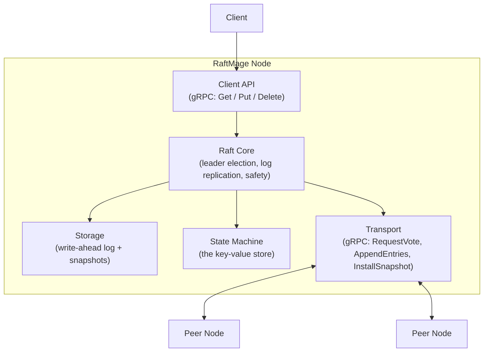
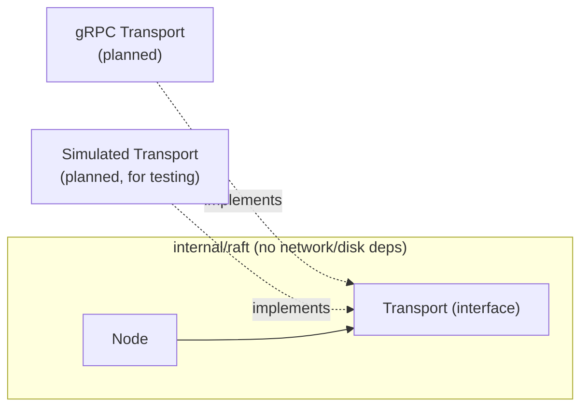
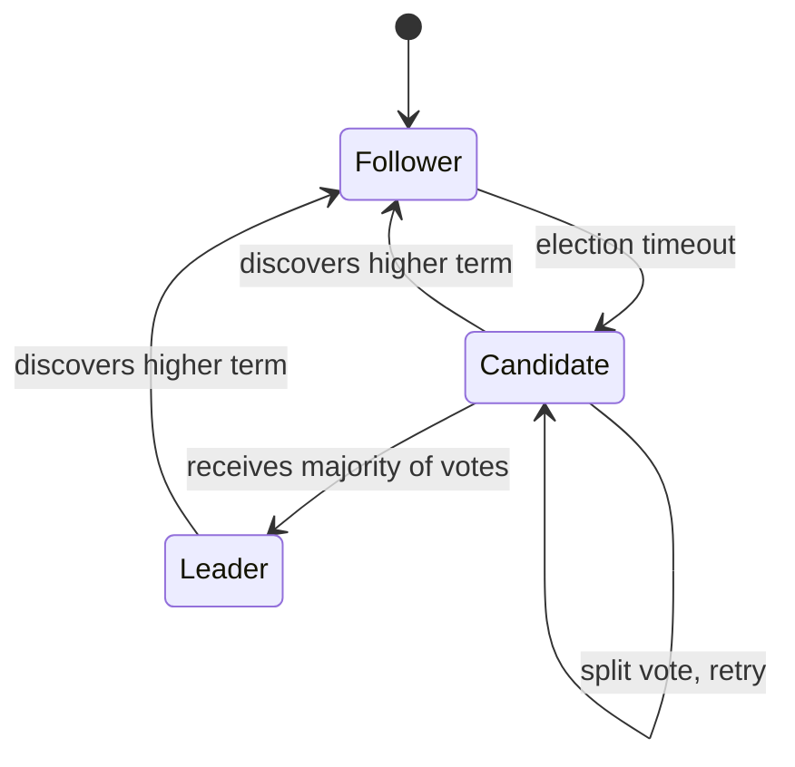

# Architecture

## Overview

RaftMage is a distributed key-value store that uses the Raft consensus algorithm to keep multiple replicas of the same data in agreement, even when nodes crash or the network partitions. This document describes the target architecture and tracks which parts are implemented today versus planned.

## Component diagram



| Component | Status |
|---|---|
| Raft Core (roles, terms, leader election, randomized election timeout) | Implemented |
| Log replication (AppendEntries) | Planned |
| Storage (WAL + snapshots) | Planned |
| State Machine (KV store) | Planned |
| Transport (real gRPC) | Planned — election currently runs over an injected in-process `Transport` interface for testing, not real network calls |
| Client API | Planned |

## Raft core dependency direction

The Raft core (`internal/raft`) depends only on interfaces it defines itself (`Transport`) — it has no import on gRPC, no import on any storage package. Concrete implementations of those interfaces get wired in from outside the package (dependency injection), which keeps the consensus logic testable without a real network and, later, drivable by a deterministic simulation harness that can inject network delay, message loss, and partitions.



## Node role state machine

Every node is in exactly one of three roles at any time.



`Node.Run()` starts a background goroutine (`runElectionTimer`) that fires `StartElection` automatically once a randomized timeout (150–300ms) elapses without the node hearing from a leader or granting a vote. `Run()` is opt-in — unit tests construct nodes and drive transitions manually without ever calling it, so the extensive test suite stays deterministic and doesn't race against background timers.

One real gap remains: the timer currently only resets on granting a vote. There's no way yet for an elected **leader** to signal "I'm still alive" to its followers, because that's normally done via heartbeats — empty `AppendEntries` RPCs sent periodically by the leader — and `AppendEntries` doesn't exist yet (it's part of log replication). So today, a freshly elected leader's followers will eventually time out and start new elections regardless of whether the leader is healthy. This is expected and will be resolved once log replication adds heartbeats.

## Package layout

Only what currently exists; more packages get added as later milestones need them.

```
raftmage/
  internal/raft/     Raft consensus core — Node, roles, RequestVote RPC, election
  docs/               This document and future design docs
  private/            Gitignored personal study notes (mirrors real file paths)
```
